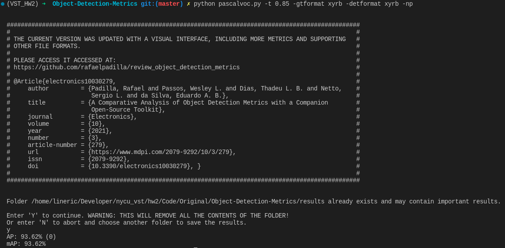
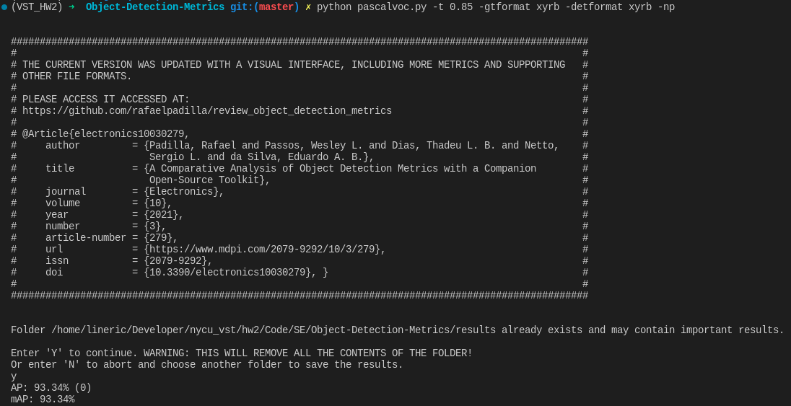

## Setup

```
conda create --name VST_HW2 python=3.8
conda activate VST_HW2
pip3 install torch torchvision torchaudio
```

```
git clone git@github.com:Megvii-BaseDetection/YOLOX.git
cd YOLOX
pip3 install -v -e .
```

### Data pre-prcess setup

YOLO格式轉換成COCO格式:  
(x_center, y_center, width, height) -> (left, top, width, height)  

由於資料normalized過，因此要乘上圖片的長或寬(1920 or 1080)

```python
import os
import json

def process_file(file_path):
    bounding_boxes = []
    with open(file_path, 'r') as file:
        for line in file:
            data = line.strip().split()
            if len(data) == 5:
                bounding_boxes.append([int(data[0]), float(data[1]), float(data[2]), float(data[3]), float(data[4])])
    return bounding_boxes

data_dir = 'train_labels'
file_list = os.listdir(data_dir)
coco_data = {
    "info": {},
    "licenses": [],
    "images": [],
    "annotations": [],
    "categories": [{"id": 0, "name": "car", "supercategory": "vehicle"}]
}

image_id = 1
annotation_id = 1

for filename in file_list:
    image_filename = filename.replace('.txt', '.jpg')
    file_path = os.path.join(data_dir, filename)
    bounding_boxes = process_file(file_path)

    image_width = 1920
    image_height = 1080

    image_info = {
        "id": image_id,
        "width": image_width,
        "height": image_height,
        "file_name": image_filename
    }

    for box in bounding_boxes:
        class_id, x_center, y_center, width, height = box

        x_center, y_center, width, height = x_center * image_width, y_center * image_height, width * image_width, height * image_height 

        annotation_info = {
            "id": annotation_id,
            "image_id": image_id,
            "category_id": class_id,
            "bbox": [round(x_center - width/2), round(y_center - height/2), round(width), round(height)],
            "area": width * height,
            "iscrowd": 0
        }

        coco_data["annotations"].append(annotation_info)
        annotation_id += 1

    coco_data["images"].append(image_info)
    image_id += 1

with open("instances_train2017.json", "w") as json_file:
    json.dump(coco_data, json_file)

data_dir = 'val_labels'

file_list = os.listdir(data_dir)

coco_data = {
    "info": {},
    "licenses": [],
    "images": [],
    "annotations": [],
    "categories": [{"id": 0, "name": "car", "supercategory": "vehicle"}]
}

image_id = 1
annotation_id = 1

for filename in file_list:
    image_filename = filename.replace('.txt', '.jpg')
    file_path = os.path.join(data_dir, filename)
    bounding_boxes = process_file(file_path)

    image_width = 1920
    image_height = 1080

    image_info = {
        "id": image_id,
        "width": image_width,
        "height": image_height,
        "file_name": image_filename
    }

    for box in bounding_boxes:
        class_id, x_center, y_center, width, height = box

        x_center, y_center, width, height = x_center * image_width, y_center * image_height, width * image_width, height * image_height 

        annotation_info = {
            "id": annotation_id,
            "image_id": image_id,
            "category_id": class_id,
            "bbox": [round(x_center - width/2), round(y_center - height/2), round(width), round(height)],
            "area": width * height,
            "iscrowd": 0
        }

        coco_data["annotations"].append(annotation_info)
        annotation_id += 1

    coco_data["images"].append(image_info)
    image_id += 1

with open("instances_val2017.json", "w") as json_file:
    json.dump(coco_data, json_file)
```

* 執行以上程式碼後會生成```instances_train2017.json```和```instances_val2017.json```檔，講此兩檔案放入```annotations```的資料夾中
* 將```train```跟```val```測資圖片資料夾重新命名為```train2017```跟```val2017```
* 並且將```annotations```,```trian2017```,```val2017```,```test```包入至```coco128```的資料夾中

最後將```coco128```的資料夾放入```datasets```中即可讓YoloX正常讀取資料

## Hyperparameters setup

改動```exps/example/custom/yolox_s.py```成以下

```python
import os

from yolox.exp import Exp as MyExp

class Exp(MyExp):
    def __init__(self):
        super(Exp, self).__init__()
        self.depth = 0.33
        self.width = 0.50
        self.exp_name = os.path.split(os.path.realpath(__file__))[1].split(".")[0]

        # Define yourself dataset path
        self.data_dir = "datasets/coco128"
        self.train_ann = "instances_train2017.json"
        self.val_ann = "instances_val2017.json"

        self.num_classes = 1

        self.max_epoch = 100
        self.data_num_workers = 4
        self.eval_interval = 1
```

改動```yolox/data/datasets/coco_classes.py```成以下
```
COCO_CLASSES = (
    "0"
)
```

改動```yolox/data/datasets/voc_classes.py```成以下
```
VOC_CLASSES = (
    "0"
)
```

最後執行以下開始訓練

```
python tools/train.py -f exps/example/custom/yolox_s.py -b 16 -o --fp16 -c yolox_s.pth
```

## Evaluate

將以下code加入至```tools/demo.py```的 ```def visual:``` 中

```
file_name = img_info["file_name"].replace('.jpg', '.txt')
file_path = f"output_labels/{file_name}"
os.makedirs(os.path.dirname(file_path), exist_ok=True)
with open(file_path, "w") as file:
    for i in range(len(bboxes)):
        box = bboxes[i]
        cls_id = int(cls[i])
        score = scores[i]
        if score < cls_conf:
            continue
        x0 = int(box[0])
        y0 = int(box[1])
        x1 = int(box[2])
        y1 = int(box[3])
        # print(f"{cls_id} {score} {x0} {y0} {x1} {y1}")
        line = f"{cls_id} {score:.5f} {x0} {y0} {x1} {y1}\n"
        file.write(line)
```

此code會將資料儲存至```output_labels```資料夾中方便之後作取用

執行

```
python tools/demo.py image -f exps/example/custom/yolox_s.py -c YOLOX_outputs/yolox_s/best_ckpt.pth --path datasets/coco128/val2017/ --save_result --conf=0.7 --device cpu
```

接著將比對程式clone下來

```
git clone https://github.com/rafaelpadilla/Object-Detection-Metrics.git
```

由於比對程式的label資料要為未normalized過得，因此將最一開始的```val_labels```測資執行以下程式


```python
import os

def convert_bbox_format(bboxes):
    converted_bboxes = []
    for bbox in bboxes:
        cls, x_center, y_center, width, height = bbox
        x_center, y_center, width, height = round(x_center*1920), round(y_center*1080), round(width*1920), round(height*1080)
        x_left = x_center - (width / 2)
        y_top = y_center - (height / 2)
        x_right = x_center + (width / 2)
        y_bottom = y_center + (height / 2)
        converted_bbox = [round(cls), round(x_left), round(y_top), round(x_right), round(y_bottom)]
        converted_bboxes.append(converted_bbox)
    return converted_bboxes

input_folder_path = "val_labels"
output_folder_path = "groundtruths/"

input_file_names = [f for f in os.listdir(input_folder_path) if f.endswith(".txt")]

for input_file_name in input_file_names:
    input_file_path = os.path.join(input_folder_path, input_file_name)
    output_file_name = os.path.splitext(input_file_name)[0] + ".txt"
    output_file_path = os.path.join(output_folder_path, output_file_name)

    original_bboxes = []

    with open(input_file_path, "r") as file:
        lines = file.readlines()
    for line in lines:
        parts = line.strip().split()  
        if len(parts) == 5:
            cls, x_center, y_center, width, height = map(float, parts)
            original_bboxes.append([cls, x_center, y_center, width, height])

    converted_bboxes = convert_bbox_format(original_bboxes)

    with open(output_file_path, "w") as output_file:
        for bbox in converted_bboxes:
            line = " ".join(map(str, bbox)) + "\n"
            output_file.write(line)
```

將生成的groundtruth資料夾內的所有檔案放入```Object-Detection-Metrics/groundtruths```, 將剛剛的output_labels資料夾裡的所有檔案放入```Object-Detection-Metrics/detections```

執行

```
python pascalvoc.py -t 0.85 -gtformat xyrb -detformat xyrb -np
```

便會印出mAP


## Add SELayer

新增一```selayer.py```至```yolox/models/```

```python
from torch import nn

class SELayer(nn.Module):
    def __init__(self, channel, reduction=16):
        super(SELayer, self).__init__()
        self.avg_pool = nn.AdaptiveAvgPool2d(1)
        self.fc = nn.Sequential(
            nn.Linear(channel, channel // reduction),
            nn.ReLU(inplace=True),
            nn.Linear(channel // reduction, channel),
            nn.Sigmoid()
        )
    def forward(self, x):
        b, c, _, _ = x.size()
        y = self.avg_pool(x).view(b, c)
        y = self.fc(y).view(b ,c, 1, 1)
        return x * y

```

這次作法將每個darknet之間放入SE layer,因此改動```yolox/models/darknet.py```成以下

```python
self.dark2 = nn.Sequential(
    *self.make_group_layer(in_channels, num_blocks[0], stride=2)
)
self.se_1 = SELayer(in_channels) # add
in_channels *= 2  # 128
self.dark3 = nn.Sequential(
    *self.make_group_layer(in_channels, num_blocks[1], stride=2)
)
self.se_2 = SELayer(in_channels) # add
in_channels *= 2  # 256
self.dark4 = nn.Sequential(
    *self.make_group_layer(in_channels, num_blocks[2], stride=2)
)
self.se_3 = SELayer(in_channels) # add
in_channels *= 2  # 512

self.dark5 = nn.Sequential(
    *self.make_group_layer(in_channels, num_blocks[3], stride=2),
    *self.make_spp_block([in_channels, in_channels * 2], in_channels * 2),
)
```

```python
def forward(self, x):
    outputs = {}
    x = self.stem(x)
    outputs["stem"] = x
    x = self.dark2(x)
    x = self.se_1(x) # add
    outputs["dark2"] = x
    x = self.dark3(x)
    x = self.se_2(x) # add
    outputs["dark3"] = x
    x = self.dark4(x)
    x = self.se_3(x) # add
    outputs["dark4"] = x
    x = self.dark5(x)
    outputs["dark5"] = x
    return {k: v for k, v in outputs.items() if k in self.out_features}
```

## Result

original: 

SE: 

## References

* ChatGPT
* https://github.com/rafaelpadilla/Object-Detection-Metrics
* https://github.com/Megvii-BaseDetection/YOLOX
